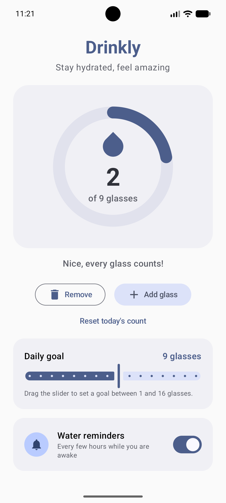

# Drinkly 💧

A lightweight, modern water-tracking app for Android, built with Jetpack Compose.

Track how many glasses of water you drink each day, watch your progress ring
fill up, and let gentle notifications remind you to stay hydrated.

> **New to Android development?** Read
> **[BEGINNER_GUIDE.md](BEGINNER_GUIDE.md)** first — it walks you from
> unzipping the project to installing your own APK, step by step.

---
<p align="center">
  
</p>
## Features

- **Progress ring** — a big visual circle that fills up as you drink
- **One-tap tracking** — `Add glass` / `Remove` buttons
- **Adjustable daily goal** — slide between 1 and 16 glasses (default 8)
- **Smart reminders** — WorkManager posts a notification every few hours,
  only between 08:00 and 21:00, and only if you leave reminders on
- **Automatic daily reset** — the counter starts fresh every new day
- **Data persistence** — your count, goal and reminder settings are saved
  with DataStore Preferences
- **Modern UI** — Material 3 with a water-inspired teal palette and dynamic
  color on Android 12+
- **Lightweight** — XML vector icons only (no PNGs), no image assets

## Tech stack

| Piece            | Choice                                   |
|------------------|------------------------------------------|
| Language         | Kotlin 2.0.21                            |
| UI               | Jetpack Compose (BOM 2024.12.01), Material 3 |
| Build            | Kotlin DSL + version catalog, AGP 8.7.3  |
| SDK              | compileSdk 35, targetSdk 35, minSdk 24   |
| Java             | 17                                       |
| Persistence      | DataStore Preferences 1.1.1              |
| Background work  | WorkManager 2.10.0                       |
| Splash           | androidx core-splashscreen 1.0.1         |

## Project structure

```
Drinkly/
├── settings.gradle.kts          # Project name, repositories, :app module
├── build.gradle.kts             # Root build script (plugins only)
├── gradle.properties            # Gradle/AndroidX settings
├── local.properties             # Local SDK path (machine-specific)
├── gradle/
│   └── libs.versions.toml       # Version catalog (all dependency versions)
└── app/
    ├── build.gradle.kts         # App module: SDK levels, Compose, deps
    └── src/main/
        ├── AndroidManifest.xml
        ├── java/com/drinkly/app/
        │   ├── MainActivity.kt              # Entry point, splash, permissions
        │   ├── data/PreferencesManager.kt   # DataStore: count, goal, settings
        │   ├── notification/NotificationHelper.kt
        │   ├── worker/WaterReminderWorker.kt  # Periodic reminder work
        │   └── ui/
        │       ├── theme/ModernTheme.kt        # Material 3 color schemes
        │       └── screens/HomeScreenModern.kt # The whole UI
        └── res/
            ├── values/strings.xml, themes.xml
            ├── drawable/          # Vector icons (drop, launcher layers)
            ├── mipmap-anydpi*/    # Adaptive + vector launcher icons
            └── xml/               # Backup rules
```

## Building

1. Open the `Drinkly` folder in Android Studio (2024.2+ recommended).
2. Wait for Gradle sync to finish (first sync downloads dependencies —
   needs internet, allow 5–15 minutes).
3. Press **Run ▶** (green triangle) with an emulator or phone selected.
4. To build an APK: **Build > Build App Bundle(s) / APK(s) > Build APK(s)**.
   Output: `app/build/outputs/apk/debug/app-debug.apk`.

## Notes

- The project intentionally ships **without** Gradle wrapper files
  (`gradlew`, `gradle-wrapper.jar`) to keep the ZIP tiny. Android Studio
  uses its own bundled Gradle, so everything works out of the box. See the
  beginner guide if you later want command-line builds.
- Minification is disabled for release builds so they behave exactly like
  debug builds. See `app/build.gradle.kts` for how to enable it.
- All Kotlin source files are written with normal, readable multi-line
  formatting and contain no escaped quotation marks.

## License

Free to use for learning and personal projects.
